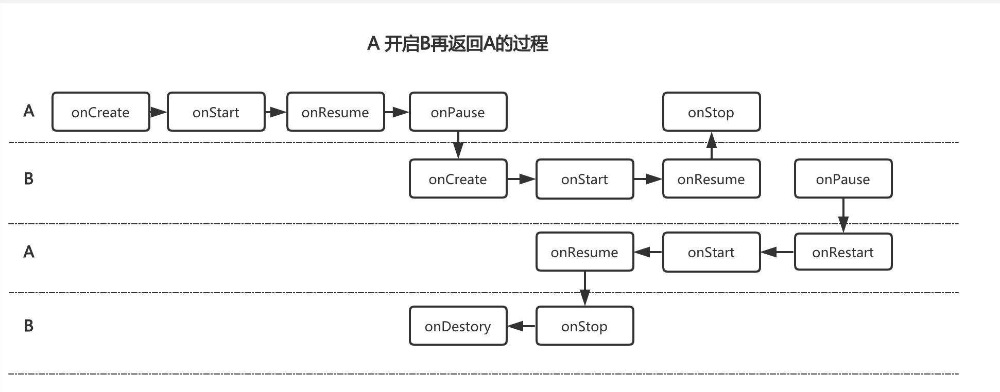

## Activity


### 1.生命周期

#### 正常情况

* onCreate ： Activity正在被创建
* onStart ：Activity正在启动，还没有出现在前台，但是可见
* onResume ： Activity出现在前台活动
* onPause ： Activity正在停止，onPause先执行完，新Activity的onResume才会执行
* onStop ： Activity已经停止、即将停止
* onRestart ： Activity正在重新创建，从不可见变为可见，比如从别的Activity返回或按下Home的时候。
* onDestroy ： Activity即将被销毁



* 如果B是透明主题或者窗口主题就不会回调A的onStop方法
* 先回调A的onPause才回调B的onCreate

### 2.启动模式


#### Standard 标准启动模式

以标准模式启动就会产生对应的实例，不做任何操作，但是以Application开启Activity会报错（FLAG_ACTIVITY_NEW_TASK），没有对应的任务栈。

```shell
Running activities (most recent first):
      TaskRecord{458741 #137 A=com.leo.component U=0 StackId=13 sz=5}
        Run #4: ActivityRecord{aee6d91 u0 com.leo.component/com.leo.activity.ActActivity t137}
        Run #3: ActivityRecord{827e46 u0 com.leo.component/com.leo.activity.ActActivity t137}
        Run #2: ActivityRecord{35cb04 u0 com.leo.component/com.leo.activity.ActActivity t137}
        Run #1: ActivityRecord{42f5226 u0 com.leo.component/com.leo.activity.ActActivity t137}
        Run #0: ActivityRecord{20b2fb2 u0 com.leo.component/.MainActivity t137}
```


但是Android7-8.1是不会报错的，他会判断传入的bundle是否为空

9.0以上又不允许了。

#### SingleTop

ActivityA和ActivityB互相开启，随后ActivityA连续开启自身，发现ActivityA不再创建，但是会回调`onNewIntent`方法

```shell
Running activities (most recent first):
      TaskRecord{86343e2 #139 A=com.leo.component U=0 StackId=15 sz=6}
        Run #5: ActivityRecord{fcfcd4b u0 com.leo.component/com.leo.activity.ActActivity t139}
        Run #4: ActivityRecord{48e575b u0 com.leo.component/com.leo.activity.ResultActivity t139}
        Run #3: ActivityRecord{525f0c8 u0 com.leo.component/com.leo.activity.ActActivity t139}
        Run #2: ActivityRecord{54f3f75 u0 com.leo.component/com.leo.activity.ResultActivity t139}
        Run #1: ActivityRecord{f89596f u0 com.leo.component/com.leo.activity.ActActivity t139}
        Run #0: ActivityRecord{725259c u0 com.leo.component/.MainActivity t139}
```


#### SingleTask

将ActivityA和ActivityB依次打开，然后在ActivityB中启动ActivityA

```
 Running activities (most recent first):
      TaskRecord{b2a72ca #140 A=com.leo.component U=0 StackId=16 sz=3}
        Run #2: ActivityRecord{d1b6ace u0 com.leo.component/com.leo.activity.ResultActivity t140}
        Run #1: ActivityRecord{c2473d3 u0 com.leo.component/com.leo.activity.ActActivity t140}
        Run #0: ActivityRecord{edf1928 u0 com.leo.component/.MainActivity t140}
```


发现ActivityB被弹出栈，被调用了相对应的onStop和onDestory方法

```
Running activities (most recent first):
      TaskRecord{b2a72ca #140 A=com.leo.component U=0 StackId=16 sz=2}
        Run #1: ActivityRecord{c2473d3 u0 com.leo.component/com.leo.activity.ActActivity t140}
        Run #0: ActivityRecord{edf1928 u0 com.leo.component/.MainActivity t140}
```

这个时候A再开启自身生命周期如下

```
2020-03-28 14:13:31.328 8401-8401/com.leo.component E/ActActivity: onPause
2020-03-28 14:13:31.328 8401-8401/com.leo.component E/ActActivity: onNewIntent
2020-03-28 14:13:31.329 8401-8401/com.leo.component E/ActActivity: onResume
```


#### SingleInstance

单独的栈，只有自己一个实例


### 3.显示意图和隐式意图

#### 隐式意图

* action 可以有多个，Intent匹配一个即可
* category，可以有多个，必须完全匹配，没有的话系统会提供DEFAULT
* data setData和setType会相互清空，提供了setDataAndType方法。

### 4.Activity栈

`taskAffinity`指定任务栈，不能和包名重复，会新建一个栈存储Activity


